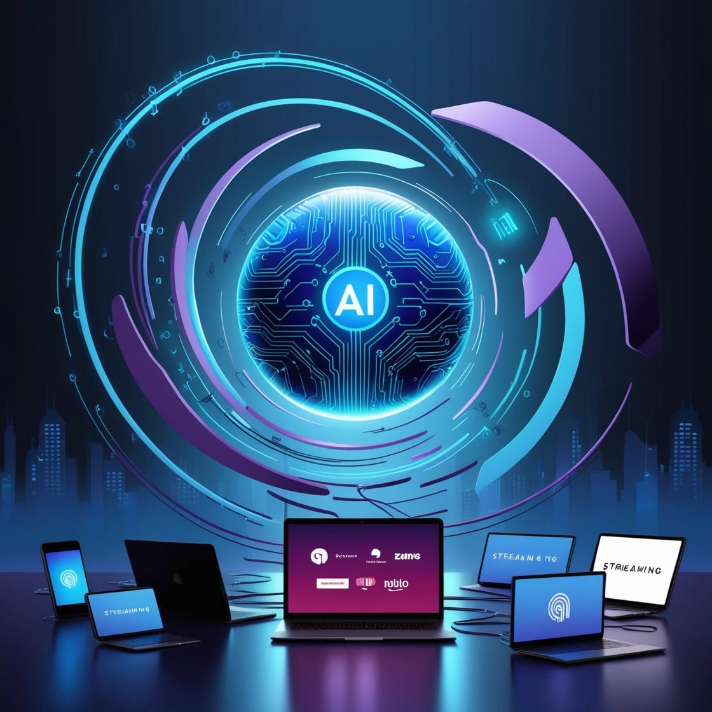
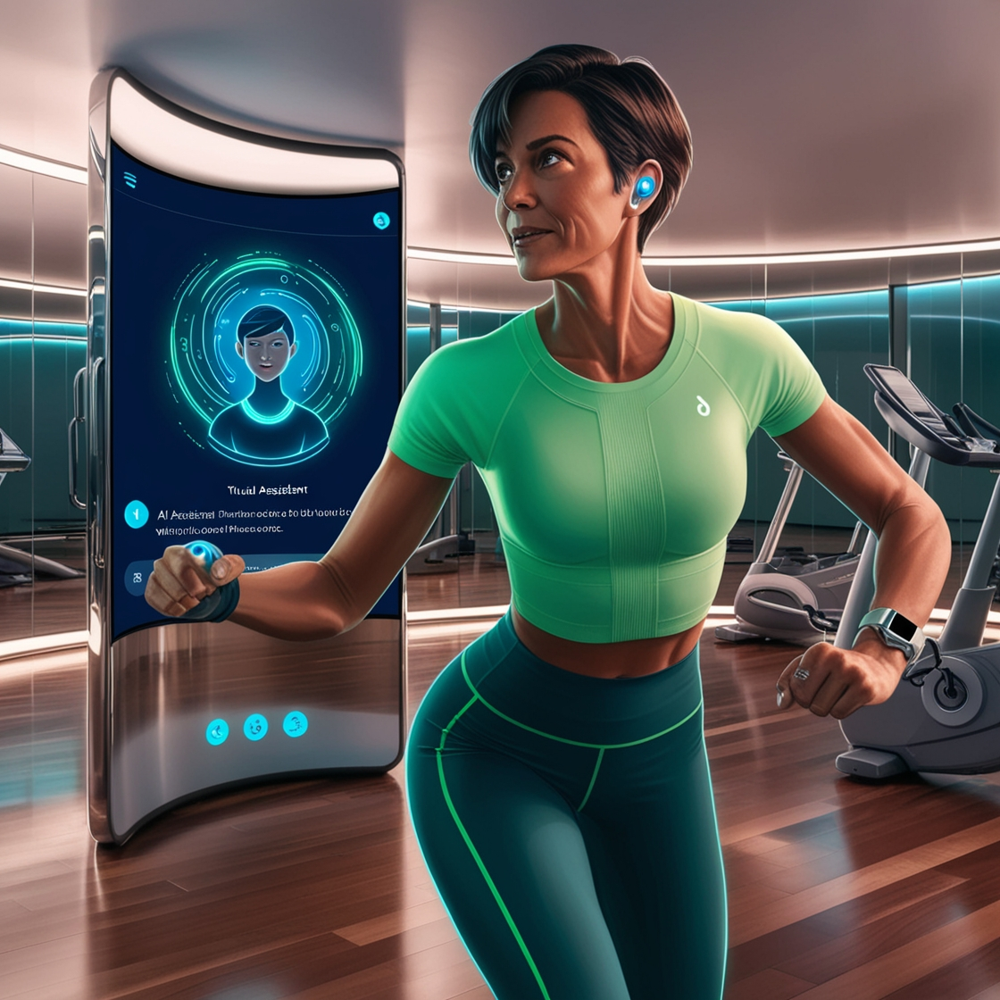
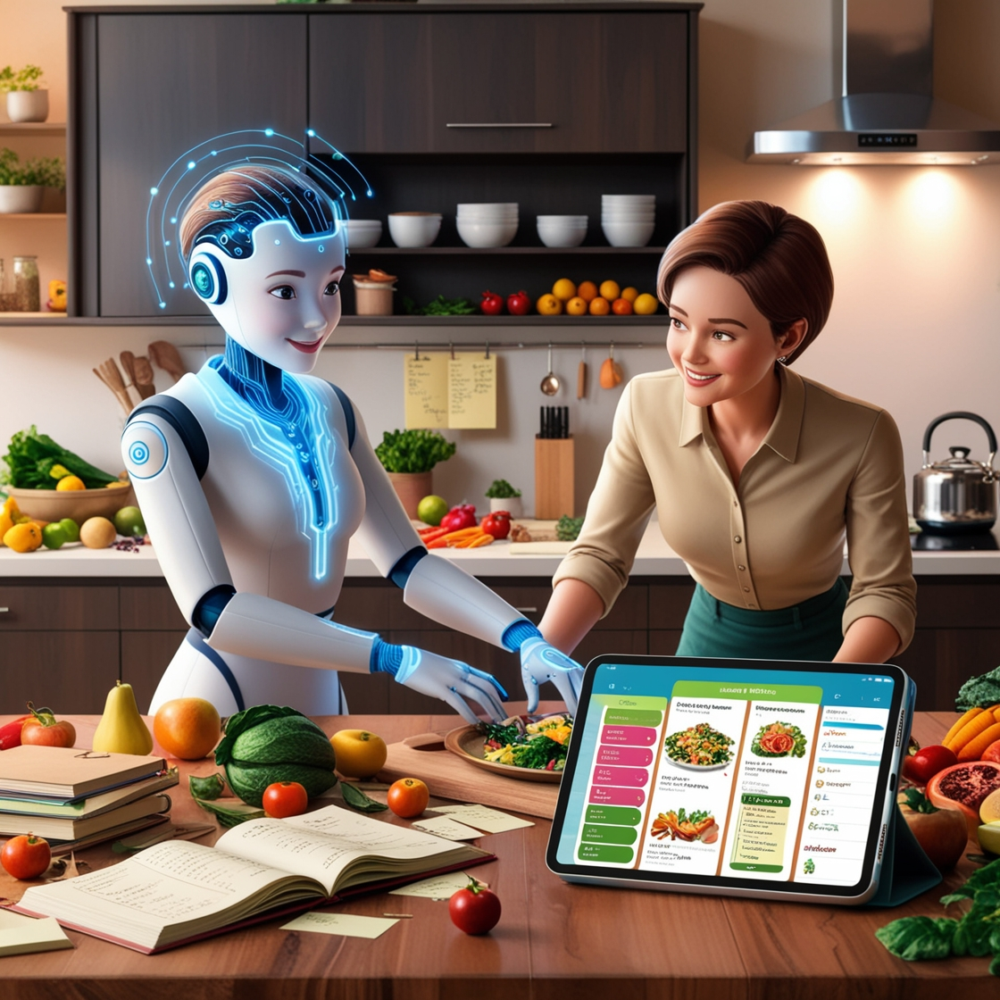

                        Projeto final do bootcamp Microsoft Copilot AI

    Descobri que a inteligência artificial está presente no meu dia a dia de forma muito mais abrangente do que eu imaginava. Nunca imaginei que ela estivesse tão integrada a serviços como streaming, redes sociais e até mesmo em uma simples pesquisa no Google.

    Minhas primeiras experiências com IA generativa foram com o ChatGPT, seguido pelo Leonardo.io e Midjourney.com. Durante umo bootcamp, tive a oportunidade de conhecer outras ferramentas incríveis, como IAs de voz e chatbots como o Copilot da Microsoft e o Gemini do Google, sendo este último o meu favorito.

    Comecei a aplicar a IA em diversas áreas da minha vida, como organização de estudos, criação de cronogramas, planejamento de refeições e acompanhamento de atividades físicas.

    A utilização da inteligência artificial contribuiu significativamente para o aumento da minha produtividade e expandiu meus horizontes, proporcionando novas perspectivas. A IA se tornou uma ferramenta indispensável para otimizar meu tempo e me auxiliar em diversas tarefas. 

